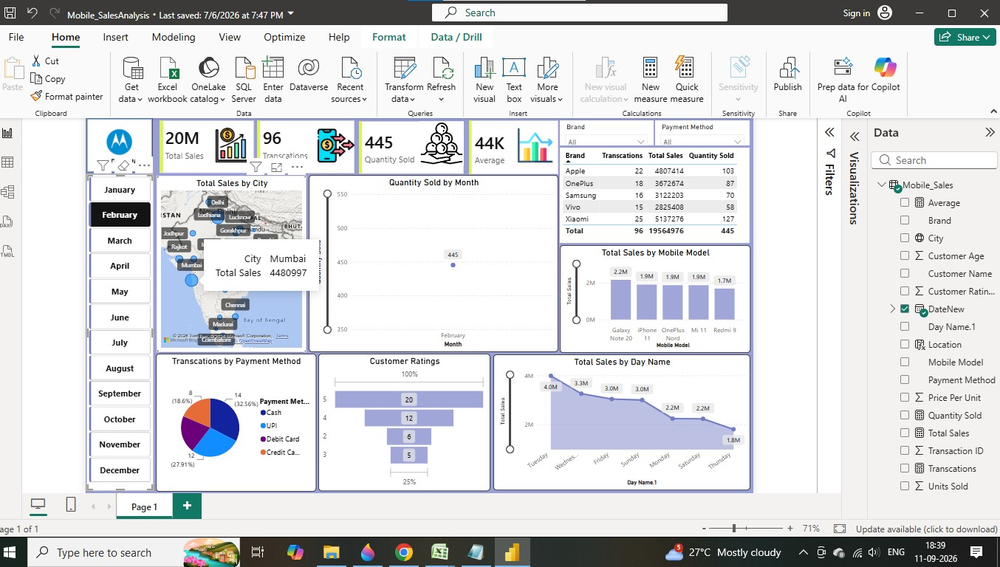
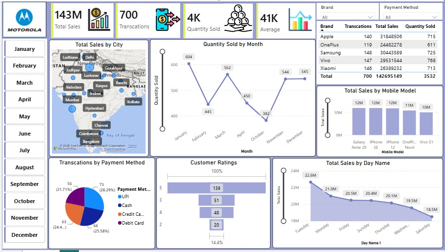

# 📱 Mobile Sales Analysis Dashboard

## 📊 Project Overview

The **Mobile Sales Analysis Dashboard** is an interactive data visualization project developed using **Microsoft Power BI**.

The project analyzes mobile sales transaction data to understand sales performance, quantity sold, customer ratings, payment methods, brands, mobile models, cities, and time-based trends.

The dashboard transforms raw sales data into interactive visualizations and key performance indicators to make sales analysis easier and more meaningful.

---

## 🎯 Project Objectives

- Analyze overall mobile sales performance
- Identify top-performing mobile brands and models
- Analyze sales performance across different cities
- Understand customer payment preferences
- Analyze customer rating patterns
- Identify monthly and day-wise sales trends
- Provide interactive visualizations for exploring sales data

---

## 📂 Dataset

The project uses a mobile sales dataset containing **700 transaction records and 13 fields**.

The dataset includes information such as:

- Transaction ID
- Date
- Day Name
- Brand
- Mobile Model
- Units Sold
- Price Per Unit
- Total Sales
- Customer Name
- Customer Age
- City
- Payment Method
- Customer Rating
- Location

---

## 🛠️ Tools Used

- **Microsoft Power BI** – Data analysis, visualization and dashboard development
- **Microsoft Excel** – Source dataset

---

## 🔄 Data Preparation

The raw mobile sales data was prepared and transformed using the data preparation capabilities available in **Microsoft Power BI**.

The data was organized into appropriate fields and measures to support sales analysis and dashboard visualization.

---

## 📌 Dashboard Features

### Key Performance Indicators

The dashboard displays important sales metrics including:

- **Total Sales**
- **Total Transactions**
- **Quantity Sold**
- **Average Sales**

### Sales Analysis

The dashboard provides analysis of:

- Total Sales by City
- Quantity Sold by Month
- Total Sales by Mobile Model
- Brand-wise sales performance
- Day-wise sales performance

### Customer Analysis

The dashboard includes:

- Customer Rating analysis
- Payment Method distribution

### Interactive Filters

Users can interact with the dashboard using filters for:

- Month
- Brand
- Payment Method

These filters allow users to explore different segments of the sales data.

---

## 📈 Dashboard Preview

### Dashboard Overview

### Detailed Analysis

---

## 💡 Key Insights

The dashboard can be used to identify:

- Top-performing mobile brands
- Best-performing mobile models
- City-wise sales performance
- Monthly quantity-selling trends
- Customer payment preferences
- Customer rating distribution
- Day-wise sales patterns

---

## 📊 Dashboard Analysis

The dashboard provides a consolidated view of mobile sales performance through multiple visualizations.

It helps users compare brands, mobile models, cities, payment methods, customer ratings, and time-based sales patterns from a single interactive dashboard.

---

## 📁 Project Files

| File | Description |
|------|-------------|
| `Mobile_SalesAnalysis.pbix` | Power BI dashboard file |
| `Mobile_Sales_Data.xlsx` | Source mobile sales dataset |
| `Screenshots/mobile-sales-dashboard.png` | Dashboard overview |
| `Screenshots/dashboard-details.png` | Detailed dashboard analysis |

---

## 🧰 Skills Demonstrated

- Data Analysis
- Data Visualization
- Business Intelligence
- Dashboard Development
- Microsoft Power BI
- Data Preparation
- Data Interpretation
- Sales Analysis

---

## 👩‍💻 Author

**Vaishnavi Chavan**

MCA Student | Aspiring Data Analyst

**Skills:** Python, SQL, Microsoft Excel, Power BI, Pandas, NumPy

---

## 🔗 Project Repository

This repository contains the Power BI dashboard, source dataset, and dashboard preview for the Mobile Sales Analysis project.
